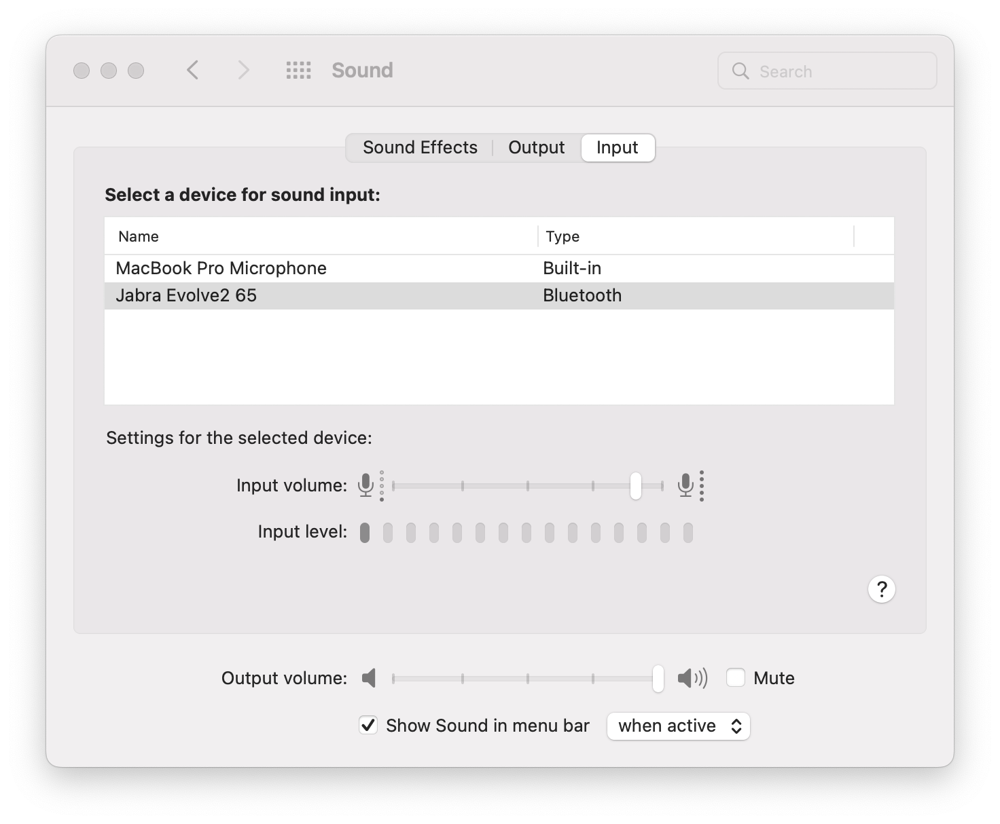

# General dev info

```sh
# publish npm module e.g.
# https://www.npmjs.com/package/@rob-myers/mvdan-sh
npm login
cd {package-root}
npm publish --access public
```

---

```sh
# Can patch npm modules with `patch-package`
npx patch-package some-package
git add patches/some-package+$version.patch
```

---

```sh
# autocrop an image using ImageMagick
brew install imagemagick
convert -fuzz 1% -trim diag-ne.png diag-ne.png

# lossless PNG minify
brew install optipng
optipng *.png

# extract pdf page 20 as high quality PNG
convert -density 1164 'Starship Geomorphs 2.0.pdf'[19] -quality 100 unsorted/output.png
```

---

```sh
# https localhost via proxy
# set chrome://flags/#allow-insecure-localhost
yarn https-proxy
```

---

```sh
# Find local ip address for mobile development
ifconfig | grep "inet " | grep -v 127.0.0.1
```

---

Spine 2d

https://en.esotericsoftware.com/spine-ui
- pan: RMB+drag, or j+LMB+drag
- Setup mode: create and configure skeletons
- Animate mode: design your animations.

https://en.esotericsoftware.com/spine-tools
- viewport select:
  - RMB to switch between last tool and back
  - deselect all: SpaceBar
  - select multiple via Cmd+Click or Cmd+Drag (from empty)
  - prev/next selection: fn + arrows keys
  - save selection: cmd + {number} (restore: {number})
  - The selected item is adjusted by dragging the mouse. The drag should start in empty space or on the item itself. If the drag starts on a different item, that item will be selected and adjusted.
- tree:
  - recursively hide: RMB dot
  - recursively open/close: RMB icon
  - show all bones: Cmd+H
  - hide all bones: RMB root
- timeline:
  - shift + LMB + drag to preview animation with interpolation
---

Fix Gimp fill colour:
> Image → Mode → RGB (rather than Indexed)

```sh
# fixed point precision
echo '2/3' | bc -l
```

---

```sh
git config --global user.name "Rob Myers"
git config --global user.email "me.robmyers@gmail.com"
```

---

```js
// https://runkit.com/rob-myers/622cee6ee13dba0008b6f845
var { pathDataToPolys } = require("svg-path-to-polygons")
let pathData = 'M 2649.328 1502.808 C 2649.328 1815.477 2521.706 2098.546 2315.37 2303.448 C 2109.034 2508.35 1823.983 2635.084 1509.124 2635.084 C 1194.265 2635.084 909.214 2508.35 702.878 2303.448 C 496.542 2098.546 368.92 1815.477 368.92 1502.808 C 368.92 1190.139 496.542 907.07 702.878 702.168 C 909.214 497.266 1194.265 370.532 1509.124 370.532 C 1823.983 370.532 2109.034 497.266 2315.37 702.168 C 2521.706 907.07 2649.328 1190.139 2649.328 1502.808 Z'
let points = pathDataToPolys(pathData, {tolerance:1, decimals:1});
// console.log(JSON.stringify(points));
console.log(JSON.stringify(points[0].filter((_, i) => i % 4 === 0).flatMap(x=>x).join(' ')));
```

---

```sh
# restrict PIDs (possibly including dead processes)
ps aux | grep nvm | awk '{print $2}'

# kill processes
kill $( ps aux | grep nvm | awk '{print $2}' )
```sh

---

# resize image
convert Screenshot_20220712-153359.png  -resize 256x256  resize_Screenshot_20220712-153359.png
```

---

Remote debug Android Chrome via USB
- https://developer.android.com/studio/debug/dev-options
- https://developer.chrome.com/docs/devtools/remote-debugging/
- ℹ️ chrome://inspect#devices

---

- https://www.baeldung.com/linux/convert-videos-gifs-ffmpeg#creating-a-custom-palette
- https://www.smashingmagazine.com/2018/11/gif-to-video/

```sh
# Convert mov to mp4
ffmpeg -i ~/Desktop/first-attempt.mov -qscale 0 output.mp4

# Convert mov to gif
ffmpeg -i ~/Desktop/first-attempt.mov -qscale 0 output.gif
# 20 seconds (orig 19s), output 4.3mb
ffmpeg -i ~/Desktop/first-attempt.mov -t 20 -filter_complex "[0:v] fps=10,scale=720:-1" output.gif
# 1.3Mb
ffmpeg -i ~/Desktop/first-attempt.mov -t 20 -filter_complex "[0:v] fps=10,scale=400:-1" output.gif
# 1.1Mb
ffmpeg -i ~/Desktop/first-attempt.mov -t 20 -filter_complex "[0:v] fps=10,scale=300:-1" output.gif

# 210kb
ffmpeg -i ~/Desktop/first-attempt.mov -t 20 -filter_complex "[0:v] fps=10,scale=400:-1" output.mp4
# 300kb
ffmpeg -i ~/Desktop/first-attempt.mov -t 20 -filter_complex "[0:v] fps=10,scale=400:-1" output.webm

# 250kb
ffmpeg -i ~/Desktop/first-attempt.mov -t 20 -filter_complex "[0:v] fps=10,scale=400:-1" -b:v 0 -crf 25 output.mp4
```

```sh
ffmpeg -i filename.mov -filter_complex "[0:v] fps=10" -b:v 0 -crf 25 output.mp4
ffmpeg -i filename.mov -filter_complex "[0:v] fps=20" -b:v 0 -crf 25 output.mp4
```

Fix ffmpeg APNG

```sh
$ ffmpeg -i ~/Desktop/apng-test.mov -plays 0 -t 1 -vf "setpts=PTS-STARTPTS, crop=1200:800, hqdn3d=1.5:1.5:6:6, scale=600:400" output.apng
dyld[12926]: Library not loaded: /opt/homebrew/opt/libtiff/lib/libtiff.5.dylib
  Referenced from: /opt/homebrew/Cellar/leptonica/1.82.0_1/lib/liblept.5.dylib
  Reason: tried: '/opt/homebrew/opt/libtiff/lib/libtiff.5.dylib' (no such file), '/usr/local/lib/libtiff.5.dylib' (no such file), '/usr/lib/libtiff.5.dylib' (no such file), '/opt/homebrew/Cellar/libtiff/4.5.1/lib/libtiff.5.dylib' (no such file), '/usr/local/lib/libtiff.5.dylib' (no such file), '/usr/lib/libtiff.5.dylib' (no such file)
Abort trap: 6

cd /opt/homebrew/opt/libtiff/lib/
ln -s libtiff.6.dylib libtiff.5.dylib

# then...
ffmpeg -i ~/Desktop/apng-test.mov -plays 0 -r 10 -vf "setpts=PTS-STARTPTS, crop=1200:800, hqdn3d=1.5:1.5:6:6, scale=600:400" ~/Desktop/output.apng
ffmpeg -i ~/Desktop/apng-test.mov -plays 0 -r 1 -vf "setpts=PTS-STARTPTS, crop=1200:800, hqdn3d=1.5:1.5:6:6, scale=300:200" ~/Desktop/output.apng
```


My Pixel 5 dimensions: `464 * 851`

```js
// Field of view image generation
// static/assets/npc/fov-indicator.png
C = document.createElement('canvas')
document.body.appendChild(C)
ctxt = C.getContext('2d')

// #1
C.width = 200; C.height = 400
ctxt.fillStyle = '#ff000077'
ctxt.beginPath(); ctxt.arc(0, 200, 200, -Math.PI/4, Math.PI/4); ctxt.fill();
ctxt.beginPath(); ctxt.moveTo(0, 200); ctxt.lineTo(0 + (200 / Math.sqrt(2)), 200 - (200 / Math.sqrt(2)));
ctxt.lineTo(0 + (200 / Math.sqrt(2)), 200 + (200 / Math.sqrt(2))); ctxt.closePath(); ctxt.fill();

// #2
C.width = 200; C.height = 400;
ctxt.strokeStyle = '#ffff00';
ctxt.setLineDash([8, 4]);
ctxt.lineWidth = 2;
ctxt.beginPath(); ctxt.arc(0, 200, 200, -Math.PI/4, Math.PI/4); ctxt.stroke();
ctxt.beginPath(); ctxt.moveTo(0, 200); ctxt.lineTo(0 + (200 / Math.sqrt(2)), 200 - (200 / Math.sqrt(2))); ctxt.stroke();
ctxt.beginPath(); ctxt.moveTo(0, 200); ctxt.lineTo(0 + (200 / Math.sqrt(2)), 200 + (200 / Math.sqrt(2))); ctxt.stroke();
```

---

Boxy SVG Shortcuts
- Zoom to selected object: `3`

---

Jabra recording: keep Sound open so can see Mic Level.



---

Filter Chrome DevTools console

1. Hide Chrome extension errors
2. Ignore Gatsby-related preload warnings

```
-chrome-extension: -/data.json\swas\spreloaded/
```

## Spriter shortcuts

- Parallels: Cmd; Backspace --> Delete
- Parallels: Backspace; Cmd --> Shift + Delete
- Undo: `Cmd+Z`, Redo: `Ctrl+Y`
- Prev keyframe `1`; Next keyframe: `2`; Goto frame 0: `3`; Play/pause: `4` 
- Copy selected object to all keyframes: `Ctrl D`
- Copy entire frame `Ctrl + Shift + C`
- Paste entire frame: `Ctrl + V`
- Delete keyframe: click keyframe then `Cmd + Backspace` (Delete)
- ℹ️ Saw issue where 0 wasn't a proper keyframe (can copy to it first)
- Rotate bone: drag tip
- Multi-select bone: Ctrl click bone, or drag select in hierarchy
- Pan: Hold space and drag mouse
- BUG in bone hierarchy but if goto next keyframe and back, refreshes